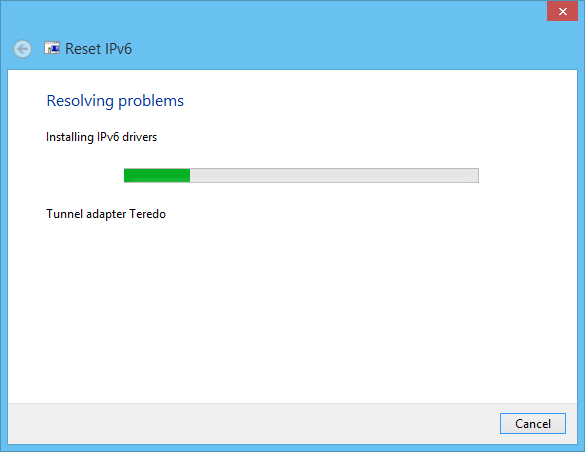

Reset-IPv6
==========

### Troubleshooting Pack to fully reset the Windows IPv6 Stack.

 
-> ##[Download](https://github.com/Tulpep/Reset-IPv6/releases/download/v1.0/ResetIPv6.exe) <-

Sometimes due incompatible software, like Checkpoint Secure Client, the Windows IPv6 stack is broken. The virtual IPv6 interfaces (ISATAP, 6to4, Teredo and IP-HTTPS) stop working.These interfaces are needed by technologies like Direct Access to work.

Use this troubleshooting pack when you have errors like *Failed to open tunnel adapter* or *Interface creation failure*.

If even after uninstall incompatible software, the IPv6 transition technologies interfaces are unusable, run this troubleshooting pack. 

---

* It uses the new Windows 7 Troubleshooting platform to have the best experience.
* Detects if you really have the problem before continue.
* Uninstall and install again all Teredo, 6to4, IPHTTPS and ISATAP devices. 
* Reset the IPv6 stack to default settings.
* It Triggers a full group policy update.
* It restarts the computer and shows a successful message at the end. Be careful saving all your changes before apply the fix.
* Works in all Window 7 and Windows 2008 R2 editions, and on both x86 and amd64.
* Reset IPv6 is currently only in English but is capable to fix issues in Spanish and English Systems. We’ll enable other languages soon.
* Requires administrative privileges.
* You can test the tool simulating the error running the command netsh interface teredo set state servername="failed to open". When you finish run netsh interface teredo set state server= to return to the default state.
* Reset IPv6 is totally free and open source. If you want you can dig into the source code and be in peace. All files are digitally signed.