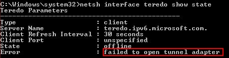

Reset-IPv6
==========

### Troubleshooting Pack to fully reset the Windows IPv6 Stack.

Sometimes due incompatible software, like Checkpoint Secure Client, the Windows IPv6 stack is broken. The virtual IPv6 interfaces (ISATAP, 6to4, Teredo and IPHTTPs) stop working. These interfaces are needed by technologies like Direct Access to work.

Use this troubleshooting pack when you have errors like *Failed to open tunnel adapter* or *Interface creation failure*.

If even after uninstall incompatible software the IPv6 transition technologies interfaces are unusable run **Reset IPv6**. 